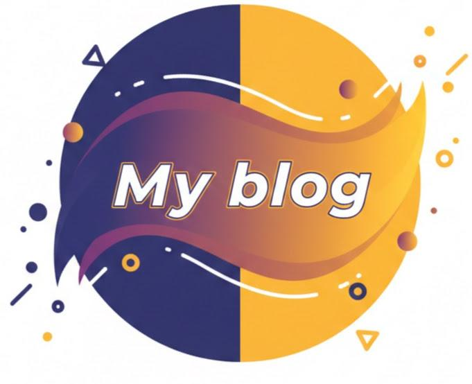
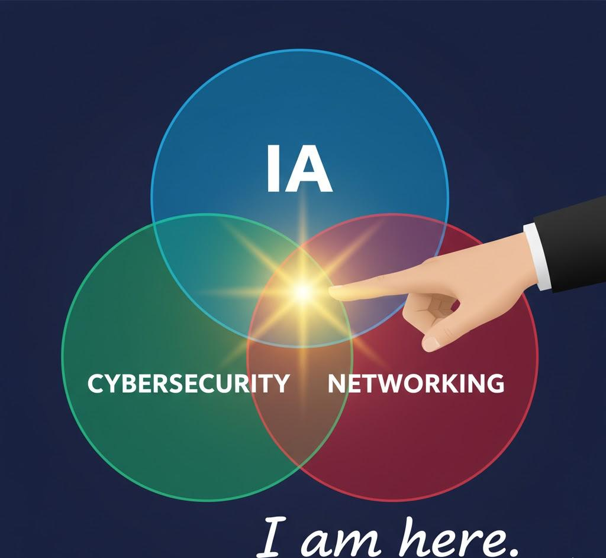
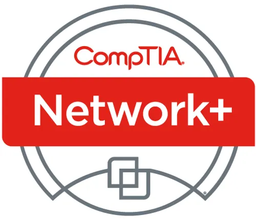
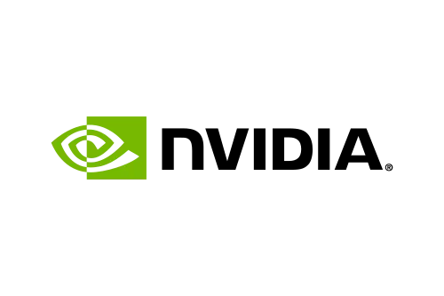
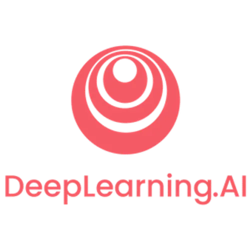

  
  &nbsp;&nbsp;&nbsp;
  
  &nbsp;&nbsp;&nbsp;
  
  &nbsp;&nbsp;&nbsp;
  

  <!-- Dynamic profile view counter -->
  

---

# Hi, I’m **Amolitho**, Engineering Student in Telecommunications & Networks

I’m currently studying at **Institut Galilée, Université Sorbonne Paris Nord**, where I position myself exactly at the intersection of **Networking**, **Cybersecurity**, and **Artificial Intelligence**.  

In short: **I apply AI to Security in Network Systems**, and I love building concrete, technical, and impactful projects in that space.

  <!-- Add your illustration image here -->
  

---

## 🔧 Projects I Work On

I enjoy exploring how AI can enhance network visibility, threat detection, and resilience. Here are a few examples of what I build:

- **ML based DDoS Detection with Kubernetes** — *[link](https://github.com/Bamolitho/ml-ddos-detection-with-kubernetes)*  
- **Deep Learning for Website Classification (legitimate or not)** — *[link](https://github.com/Bamolitho/phishing-detection-ml)*  
- **Vulnerability Remediation: Docker Unauthorized RCE** — *[link](https://github.com/Bamolitho/docker_unauthorized-rce)*  

If you want to see more, feel free to explore my repositories — **I publish a lot of hands-on work and experiments.**

---

## 📝 Articles I Write

I regularly publish write-ups, research notes, and technical breakdowns. Some examples:

- Faut-il encore savoir coder ? — *[link](https://bamolitho.github.io/portfolio/article)*  
- More coming soon…

---

## 🎓 Certifications I Hold

These help strengthen my foundations and validate my skills:

<table>
  <tr>
    <td align="left" width="70%">
      <strong>CompTIA Network+</strong> — <a href="https://www.credly.com/badges/d0c3d47d-687f-4e7a-a6e6-52e82700c67c">Verification link</a>
    </td>
    <td align="right" width="30%">
      
    </td>
  </tr>
</table>

<table>
  <tr>
    <td align="left" width="70%">
      <strong>NVIDIA: Fundamentals of Deep Learning</strong> — <a href="https://learn.nvidia.com/certificates?id=OYqUzikDRayFV0RfUPLXbw">Verification link</a>
    </td>
    <td align="right" width="30%">
      
    </td>
  </tr>
</table>

<table>
  <tr>
    <td align="left" width="70%">
      <strong>Machine Learning Specialization — DeepLearning.ai</strong> — <a href="https://www.coursera.org/account/accomplishments/specialization/ZVJNZEKFGORI">Verification link</a>
    </td>
    <td align="right" width="30%">
      
    </td>
  </tr>
</table>

---

# Want to learn more?

You can explore my projects, follow my updates, and reach out through my links above. I’m always working on something new in the areas of intelligent network defense and applied AI security.
